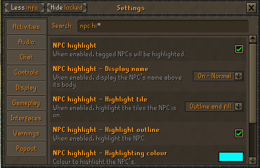
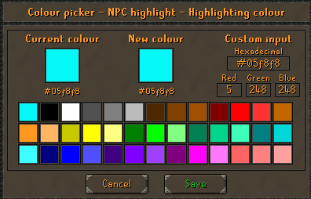
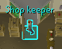
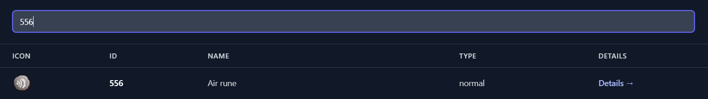

# Shopper

- **Buys and sells items at your favorite shops**

## Getting started:

- **Update your settings to enable NPC highlight**

- **Select the first Cyan (blue) color. See the highlighted NPC below as an example**

- **Find the Item ID of the item you'd like to buy/sell at https://osrsplugins.com/items**

- **As you can see, I am looking to buy Air runes, so I looked up "Air rune" and its corresponding ID is 556**

- **Then I input ID 556 in the script GUI along with the amount I'd like to buy**

## Consider supporting my work :

**https://ko-fi.com/eqp48**
